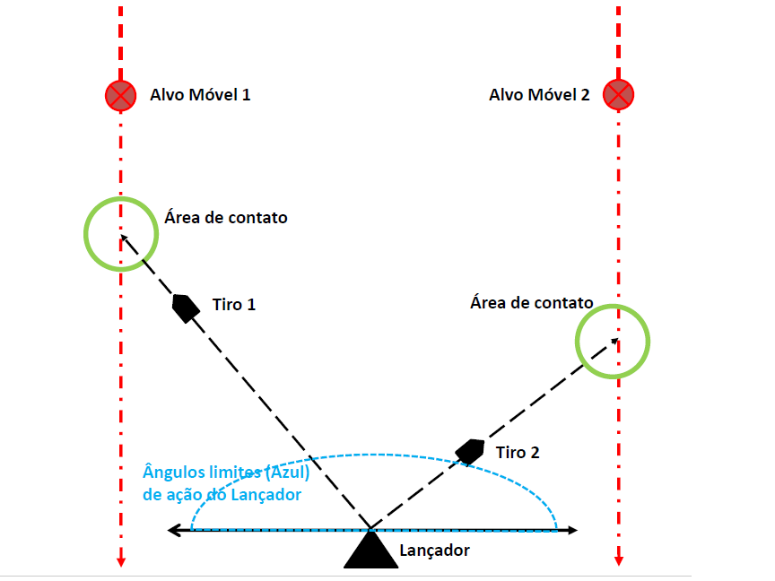

# antimissile_system
## Problem Schema

**Create a scenario with as many Launchers as needed. The solution must use a number of Launchers capable of ensuring that no Mobile Target reaches the destination, but preserving the best and most economical solution (comment on the choice in the report).**

During the code development the structures used were the implementation of the _Runnable_ interfaces to build the threads. Also called the _pool of 
threads_, the interface declares a single _run_ method. The classes Launcher, Shooter, Menu and Target received this interface.

The structure of this implementation allows the construction of threads to be a fixed number, through the so-called _executors_, and if the method is called and all threads are in use there is a queue creation so that the thread that finishes the task.

Typically, multiple execution threads handle a shared object in memory. For a better handling of these objects there is a concept called Mutual Exclusion that is implemented in synchronized threads. This allows you to coordinate the data of these objects from competing threads. Built with the _synchronized_ prefix before the _run_ methods.

**There must be at least two Moving Targets at the start of the application. Five new Moving Targets must be created every 50 milliseconds.**

**Real-Time Escalation is important to verify when a task, or a set of tasks, is scalable. It is known that before a system goes into operation, tests can be performed.**

REFERENCES

[1] H. M. DEITEL, P. J. DEITEL. JAVA COMO PROGRAMAR. São Paulo. Pearson. 6ºed. 2005.

[2] DE MORAES, C. C., CASTRUCCI, P. L., Engenharia de Automação Industrial. São Paulo: LTC, 2001.

[3] JAVA GAME DEVELOPMENT SERIE. 2013. Disponível em: < https://www.youtube.com/watch?v=FjTDgspqIBo&list=PLWms45O3n--6KCNAEETGiVTEFvnqA7qCi&index=10> Acesso em 21 de fevereiro de 2022;

[4] DIALHOST INTERNET 2020. Disponível em: < https://www.dialhost.com.br/blog/vms-ou-containers> Acesso em 24 de março de 2022
